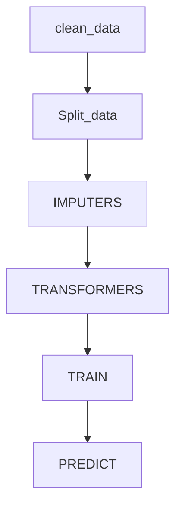

Credit Risk
----------
Report by __Jeroen De Ryck__

 Let us first start with a summary of the process of predicting defaults on the test sample
#### Process

> 1. __Cleaning__ (my job):The data was messy. Therefore we needed to look at the data dictionary and create clarity
> 2. __Splitting__(my job) The original data needed to be split into a training set and a validation set as is standard in data science. We chose for an 80 -20 split and made sure that one loan only appears in one set
> 3. __Imputation__(my job).
>  A lot of the data was missing. We therefore need to impute missing data.
> 4. __Transformation__
> In order to get better features, we needed to apply some transformations to get meaningful ratio's or get a better domain/distribution for one of our raw variable
> 5. __Fitting on Training__
> Next we needed to fit our models on the imputed,transformed data
> 6. __Predict Validation / optimize hyperparameters__
> Finally we predict our fitted model on the validation set and compare performance to optimize the hyperparameters
> 7. __Result__
> The last step is then to run the optimized model on the unknown test set

####  Workflow

----------
Our group split the work as following
 I was mostly involved with the cleaning and imputation part. while Gilles was responsible for  prediction.
### Imputation
Logistic regression : Like features in domain of -$\infty$ to $\infty$ likes normally distributed variables
Yeo- Jhonson --> improve normality
Next to the classic mean , median and interpolation imputation we also implemented a `linearModelImputer`.
The way this works is by fitting a linear relationship between two variables and then imputing the `NA`'s when the Y variable was missing.
For example we found that we could impute `rentarea` by the means of `units`, because they exhibited a strong linear relationship.

Note that we can only fit our coefficients on the the training data, because else we commit data leakage.
We also experimented with matrix completion using nuclear norm regularization implemented in the Python `FancyImpute` package

### RESULTS

We see that the model that performed best is the `XGboost` model.
This confirms the superiority of `XGboost` which is highly preferred in machine learning competitions.
Our `Logistic` Classifier also works well. However we must note that we performed a variable transformation using embedded trees.
Instead of manually transforming the variables into normalised financial ratio's we let embedded trees do this for us as a shortcut.

### Random forest versus XGboost.
Gradient boosting is very similar to a random forest although  they approach things differently.
Generally the error consists of   two parts $$Error = Bias + Variance  $$
Random forests start from fully pruned trees that are grown in parallel. They will therefore have a high level of complexity which leads to a high variance and overfitting.
Gradient Boosting starts from very simple trees .
It therefore starts by a high bias and then lowers it by adding variance.

